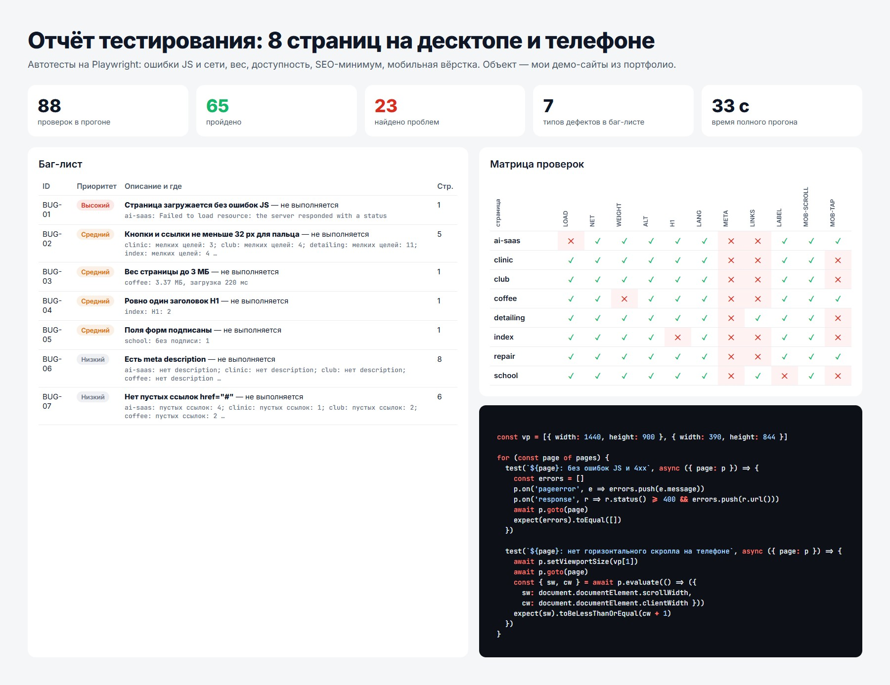

# web-qa-autotests

Аудит на Playwright, который запускается против любой статической сборки и выдаёт список
ошибок, понятный заказчику.



Для каждой страницы на десктопе и на телефоне шириной 390 px проверяются:

- ошибки JavaScript и упавшие сетевые запросы
- вес страницы и время загрузки
- один H1, атрибут языка, meta description, alt у изображений
- пустые ссылки и поля форм без подписи
- горизонтальная прокрутка и зоны нажатия меньше 32 px на мобильных

Последний прогон по [web-studio](https://github.com/YoungOver/web-studio) нашёл 23 проблемы
на 88 проверках, `report.html` группирует их по важности и показывает конкретный элемент.

```bash
npm i -D playwright-core
node run.mjs          # пишет results.json
open report.html
```
